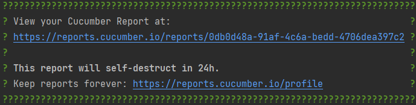

# Backend Test Automation Assignment 

## Requirements
### Environment
* GitHub account
* Java 17 (JDK) (optionally)
* Maven 3.6+ (optionally)
* Any IDE you comfortable with (eg. IntelliJ, VSCode)

### Skills
* Java 8+ (coding standards)
* Clean Code
* Maven
* Git, GitLab, GitHub

### Instructions
Fork this project

Example

   

#### Working in Web IDE (preferable)

1. Open Project in [GitPod](https://gitpod.io/from-referrer/):
2. Sing-in with GitHub account
3. Create and commit your solution into your forked repository
4. Create documentation in the README.md under the `Documentation` section
5. IMPORTANT: Enable Repository permissions (e.g. git push) for GitPod when coding from Web IDE here:
   https://gitpod.io/integrations
   

   
Details here

   Edit permission for GitHub:

   

   
   

## Documentation

# GitLab Issues API Testing

## Overview

This repository contains automated tests for the GitLab Issues API.
The tests are written in Java and utilize Cucumber, RestAssured, JUnit, and Maven to ensure the API functions correctly.
These tests provide confidence in the functionality and reliability of the GitLab Issues API.

# Tech Stack

* **Cucumber**: A behavior-driven development (BDD) framework that allows for easy test creation and understanding through plain text descriptions.
* **Java:** The primary programming language for writing the test automation code.
* **RestAssured**: A Java library used for making HTTP requests and validating responses when interacting with RESTful APIs.
* **JUnit**: A popular testing framework for writing and running test cases.
* **Maven**: A build automation and project management tool for managing project dependencies and building Java-based applications.

## API Documentation

For reference, the API documentation can be found at [GitLab Issues API Documentation](https://docs.gitlab.com/ee/api/issues.html).
This resource will provide you with in-depth details about the API endpoints and their functionality.

## How to Run Tests

To execute the test suite, follow these steps:

1. Open a command prompt or terminal and navigate to the application's root folder.
2. Run the following command to clean the project and verify the tests:

   `mvn clean verify`
3. If you want to run a specific feature, you can use a feature tag to isolate specific tests. For example:

   `mvn clean verify -q -Dcucumber.filter.tags="@GetInvalidProjectIssues"`

# Test Report

After running the tests, you can access the test report via the link provided in the console log under the line that reads "View your Cucumber Report at:". The report will contain detailed information about the test results, including passed and failed scenarios.

